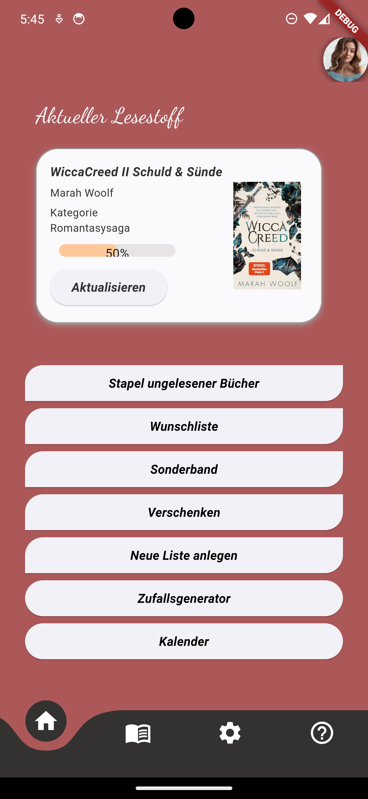

# bookieslist

Projekt während der App-Entwickler-Weiterbildung. Zur Verwaltung ungelesener Bücher.

Packages: 
- curved_navigation_bar: Navigation
- google_fonts: Dancing Script & Roboto Schriftart
- percent_indicator: Prozentanzeige beim Lesefortschritt 
- cupertino_icons: Apple Icons
- carousel_slider: Buch Karussell auf der Profilseite
- intro_slider: Einführungs Slider 
- sign_in_with_apple: Apple Login
- button_animations: Verbesserte Buttonanimation
- constants: Verbesserung des Codes
- flutter_animate: für Animationen
- infinite_scroll_pagination: Scrollfunktionen
- fl_chart: Diagramme (Momentan noch nicht verbaut, soll zum Lesefortschritt tracken eingebaut werden)
- intl: Unterstützung für Internationalisierung
- shimmer: Schimmereffekt beim Laden der Buchcover
- flutter_rating_bar: Buch Sternebewertung
- rflutter_alert: Popup Benachrichtigungen
- image_picker: Profilbild aus dem Handyordner entnehmen 
- email_validator: Validierung von E-Mail-Adressen
- http: http Abfragen
- firebase_core: Firebase Anbindung
- flutter_barcode_scanner: ISBN Scanner
- googleapis: Google Bücher API
- flutter_launcher_icons: App Icons
- flutter_native_splash: Splash Screen
- flutter pub add flutter_animate - Animationen
- flutter_riverpod: Riverpod
- riverpod_annotation: Riverpod
- animate_do - Animation
# BookiesList
